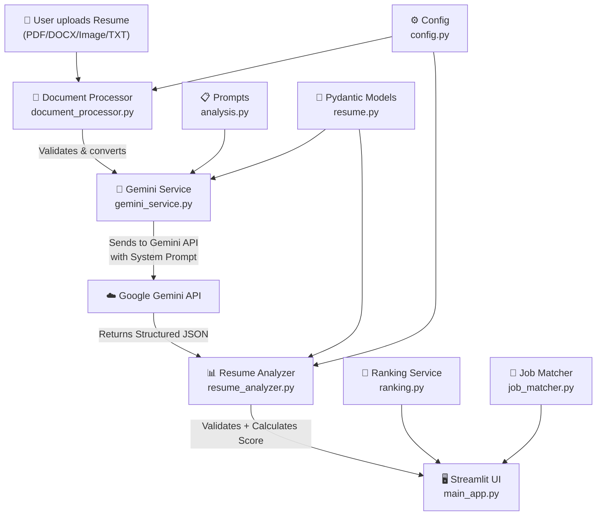

# Resume Analyzer Agent — Complete Project Summary

## 🎯 Project Kya Hai?

Yeh ek **AI-powered Resume Analyzer** web application hai jo **Streamlit** (Python web framework) aur **Google Gemini API** ke upar bana hai.

**Core Idea:** User resume upload karta hai → Gemini AI resume ko analyse karta hai → structured scores, strengths, weaknesses, aur recommendations deta hai.

### Dono Modes:
1. **Single Resume Analysis** — Ek resume upload karo, detailed analysis lo
2. **Recruiter/Batch Mode** — Multiple resumes upload karo, ranking aur comparison lo

---

## 🏗️ Architecture Overview (Data Flow)



### Data Flow Summary (Step-by-Step):

| Step | Kya Hota Hai | File |
|------|-------------|------|
| 1 | User Streamlit UI pe resume upload karta hai | `main_app.py` |
| 2 | File validate hoti hai (size, format, magic bytes) | `document_processor.py` |
| 3 | File ko Gemini-friendly format mein convert kiya jata hai (base64/text) | `document_processor.py` |
| 4 | System prompt + analysis prompt banta hai | `analysis.py` (prompts) |
| 5 | Gemini API ko call hoti hai with structured output schema | `gemini_service.py` |
| 6 | Response parse hota hai Pydantic models mein | `resume.py` (models) |
| 7 | Weighted overall score calculate hota hai (deterministic, not LLM) | `resume_analyzer.py` |
| 8 | Results Streamlit UI pe render hote hain | `main_app.py` + `components.py` |
| 9 | (Optional) Multiple resumes compare/rank hote hain | `ranking.py` + `job_matcher.py` |

---

## 📁 Complete File-by-File Breakdown

### Root Level Files

| File | Kya Karta Hai | Zaroori Hai? |
|------|--------------|-------------|
| [`.env.example`](file:///d:/01_Career/01_Agentic%20AI/Agentic%20AI%20Projects/Resume-Analyzer-Agent/.env.example) | Template file — shows users ko ki `.env` mein kya daalna hai (GEMINI_API_KEY) | ✅ Zaroori — new users ko guide karta hai |
| [`.gitignore`](file:///d:/01_Career/01_Agentic%20AI/Agentic%20AI%20Projects/Resume-Analyzer-Agent/.gitignore) | Git ko batata hai ki kaun si files track nahi karni (`.env`, `venv/`, `__pycache__/`, etc.) | ✅ Zaroori — secrets aur junk files ko Git se bahar rakhta hai |
| [`README.md`](file:///d:/01_Career/01_Agentic%20AI/Agentic%20AI%20Projects/Resume-Analyzer-Agent/README.md) | Project documentation — setup instructions, features, usage guide | ✅ Zaroori — portfolio aur user guidance ke liye |
| [`requirements.txt`](file:///d:/01_Career/01_Agentic%20AI/Agentic%20AI%20Projects/Resume-Analyzer-Agent/requirements.txt) | Python dependencies list — `pip install -r requirements.txt` se sab install hota hai | ✅ Zaroori — bina iske dependencies ka pata nahi chalta |
| [`pyproject.toml`](file:///d:/01_Career/01_Agentic%20AI/Agentic%20AI%20Projects/Resume-Analyzer-Agent/pyproject.toml) | Project metadata + pytest configuration (test paths, python path) | ✅ Zaroori — pytest properly chalane ke liye |

---

### `.streamlit/` Directory

| File | Kya Karta Hai | Zaroori Hai? |
|------|--------------|-------------|
| [`config.toml`](file:///d:/01_Career/01_Agentic%20AI/Agentic%20AI%20Projects/Resume-Analyzer-Agent/.streamlit/config.toml) | Streamlit app ka dark theme, colors, max upload size, aur analytics off karta hai | ✅ Zaroori — bina iske app default (ugly) theme mein dikhega |

---

### `app/` — Main Application Code

#### `app/__init__.py`
```python
"""Multimodal Resume Analyzer & Recruiter Ranking Agent."""
```
> **Kya Karta Hai:** Python ko batata hai ki `app/` ek package hai. Sirf ek docstring hai.
> 
> **Zaroori Hai?** ✅ Haan — Python package system ke liye zaroori hai. Iske bina `from app.config import ...` kaam nahi karega. Lekin content wise sirf 1 line hai, jo bilkul normal hai. **Ise reduce mat karo.**

---

#### [`app/config.py`](file:///d:/01_Career/01_Agentic%20AI/Agentic%20AI%20Projects/Resume-Analyzer-Agent/app/config.py) — Central Configuration (78 lines)

**Kya Karta Hai:** Poore project ki configuration ek jagah rakhta hai:

| Setting | Purpose |
|---------|---------|
| `GEMINI_API_KEY` | `.env` se API key load karta hai |
| `GEMINI_MODEL` | Kaun sa Gemini model use karna hai (`gemini-3.8-flash`) |
| `INLINE_SIZE_LIMIT_BYTES` | 20MB se chhoti files inline base64 jaati hain, badi files Files API se |
| `SUPPORTED_FILE_TYPES` | Har file extension ke liye: display label, MIME type, processing strategy |
| `MAX_FILE_SIZE_MB/BYTES` | Upload limit (50 MB) |
| `MAX_BATCH_SIZE` | Ek batch mein max 50 resumes |
| `SCORING_WEIGHTS` | 8 categories ka weight (total = 100). **Yeh deterministic scoring ka backbone hai** |
| `PRIVACY_NOTICE` / `FAIRNESS_NOTICE` | UI mein dikhane ke liye notices |

**Kyun Zaroori:** Agar yeh config alag file mein na ho, to har jagah hardcoded values hongi. Ek jagah change karna easy hai.

---

### `app/models/` — Data Schemas

#### `app/models/__init__.py`
> 1-line docstring. Python package marker. **Normal hai, reduce mat karo.**

#### [`app/models/resume.py`](file:///d:/01_Career/01_Agentic%20AI/Agentic%20AI%20Projects/Resume-Analyzer-Agent/app/models/resume.py) — Pydantic Models (256 lines)

**Yeh file project ka DATA BACKBONE hai.** Gemini ka response exactly isi structure mein aata hai.

**Models ka hierarchy:**

```
FullResumeAnalysis           ← Top-level result (score + status + analysis + optional job match)
├── ResumeAnalysis           ← Main analysis (all resume data)
│   ├── ContactInfo          ← Name, email, phone, LinkedIn
│   ├── EducationEntry[]     ← Degree, institution, year
│   ├── ExperienceEntry[]    ← Title, company, duration, highlights
│   ├── ProjectEntry[]       ← Project name, tech, outcome
│   ├── CategoryScore[]      ← 8 scoring categories with evidence
│   ├── StrengthItem[]       ← Strengths with evidence
│   ├── WeaknessItem[]       ← Weaknesses with evidence
│   ├── RecommendationItem[] ← Actionable advice with priority
│   ├── ATSAnalysis          ← ATS compatibility details
│   ├── VisualAnalysis       ← Layout, photo detection
│   └── KeywordAnalysis      ← Found/missing keywords
├── JobMatchAnalysis         ← Optional job match result
│   └── JobRequirement[]     ← Each JD requirement met/unmet
└── RecruiterResults         ← Batch mode wrapper
    └── CandidateSummary[]   ← Compact per-candidate summary for ranking table
```

**Dual Purpose:**
1. Gemini ko JSON schema provide karta hai → Gemini isi format mein output deta hai
2. Response ko validate karta hai → Invalid data se app crash nahi hoga

**Kyun Zaroori:** Bina structured models ke, Gemini random JSON de sakta hai. Pydantic validate karta hai ki data sahi format mein hai (scores 0-100 range mein, required fields present, etc.).

---

### `app/prompts/` — LLM Prompts

#### `app/prompts/__init__.py`
> 1-line docstring. Package marker. **Normal, reduce mat karo.**

#### [`app/prompts/analysis.py`](file:///d:/01_Career/01_Agentic%20AI/Agentic%20AI%20Projects/Resume-Analyzer-Agent/app/prompts/analysis.py) — AI Prompts (145 lines)

**3 Main Components:**

| Component | Kya Karta Hai |
|-----------|--------------|
| `SYSTEM_INSTRUCTION` | Gemini ko "Resume Analyst" persona deta hai + **6 safety rules** (prompt injection defense, fairness, no hallucinations, photo handling, evidence-based, concise) |
| `RESUME_ANALYSIS_PROMPT` | 8 scoring categories explain karta hai + extraction instructions |
| `JOB_MATCH_PROMPT` | Job description se matching kaise karni hai, yeh batata hai |
| `build_analysis_prompt()` | Helper function — agar job description hai to dono prompts combine karta hai |

**Kyun Zaroori:** Prompts ko alag file mein rakhne se:
- Prompts update karna easy hai bina code change kiye
- Safety rules centralized hain
- Testing mein mock karna easy hai

---

### `app/services/` — Business Logic Layer

#### `app/services/__init__.py`
> 1-line docstring. Package marker. **Normal, reduce mat karo.**

#### [`app/services/document_processor.py`](file:///d:/01_Career/01_Agentic%20AI/Agentic%20AI%20Projects/Resume-Analyzer-Agent/app/services/document_processor.py) — Document Processing (513 lines)

**Sabse badi service file.** File upload se lekar Gemini-ready input banana — sab yahi hota hai.

**Key Functions:**

| Function | Kya Karta Hai |
|----------|--------------|
| `validate_file()` | Extension check, size check, empty check, magic bytes check |
| `_validate_content()` | PDF, PNG, JPEG, WebP ke magic bytes verify karta hai (corrupt files catch) |
| `process_document()` | Main dispatcher — file type ke hisaab se sahi processor call karta hai |
| `_process_document_type()` | PDF → base64 encode (ya Files API for 20MB+ files) |
| `_process_image_type()` | Image → base64 encode (ya Files API for large) |
| `_process_docx()` | DOCX → `python-docx` library se text extract |
| `_process_rtf()` | RTF → `striprtf` library se text extract |
| `_process_text()` | TXT/MD → UTF-8 decode (latin-1 fallback) |
| `build_gemini_input()` | ProcessedDocument ko Gemini API format mein convert |

**2 Important Data Classes:**
- `ProcessedDocument` — Processed file ka result (base64 data ya extracted text)
- `ValidationResult` — Validation ka result (valid/invalid + error message)

**Kyun Zaroori:** Multimodal support ka backbone. Bina iske sirf plain text files kaam karengi.

---

#### [`app/services/gemini_service.py`](file:///d:/01_Career/01_Agentic%20AI/Agentic%20AI%20Projects/Resume-Analyzer-Agent/app/services/gemini_service.py) — Gemini API Integration (189 lines)

**Google Gemini API se baat karne ki saari logic yahan hai.**

| Function | Kya Karta Hai |
|----------|--------------|
| `get_client()` | Gemini API client banata hai (API key se) |
| `_build_response_schema()` | Pydantic model ka JSON schema nikalta hai → Gemini ko structured output ke liye deta hai |
| `analyze_resume()` | **MAIN FUNCTION** — document + prompt → Gemini API call → structured JSON response |
| `_extract_json()` | Fallback JSON parser — agar Gemini markdown code block mein JSON de to bhi extract kar le |

**Key Features:**
- **Retry Logic:** Rate limits (429, 503) pe exponential backoff (2s → 4s → 8s), max 3 retries
- **Structured Output:** Gemini ko response schema diya jata hai, to response exactly usi format mein aata hai
- **Privacy:** `store=False` — Gemini interactions store nahi hote

---

#### [`app/services/resume_analyzer.py`](file:///d:/01_Career/01_Agentic%20AI/Agentic%20AI%20Projects/Resume-Analyzer-Agent/app/services/resume_analyzer.py) — Orchestrator (315 lines)

**Yeh file sab kuch coordinate karti hai — document processing → Gemini call → validation → result assembly.**

| Function | Kya Karta Hai |
|----------|--------------|
| `calculate_overall_score()` | **Deterministic** weighted scoring — LLM opinion nahi, math se score calculate karta hai. 8 categories × unke weights = overall score |
| `validate_analysis()` | Sanity checks — extreme score variance detect karta hai, missing strengths/weaknesses |
| `analyze_single_resume()` | **MAIN PIPELINE:** validate → process → Gemini call → parse → score → assemble result. Har step pe error handling hai. |
| `analyze_batch()` | Multiple resumes sequentially process karta hai. Ek resume fail ho to baki pe asar nahi padta. Progress callback for UI. |
| `_empty_analysis()` | Error cases ke liye ek minimal valid `ResumeAnalysis` object banata hai (taaki UI crash na ho) |

**Kyun Important:** `calculate_overall_score()` intentionally LLM se nahi aata — yeh **deterministic** hai. Matlab same scores → always same overall score. Yeh reproducibility ke liye zaroori hai.

---

#### [`app/services/job_matcher.py`](file:///d:/01_Career/01_Agentic%20AI/Agentic%20AI%20Projects/Resume-Analyzer-Agent/app/services/job_matcher.py) — Job Match Helpers (43 lines)

| Function | Kya Karta Hai |
|----------|--------------|
| `has_job_match()` | Check karta hai ki result mein job match data hai ya nahi |
| `get_match_reasons()` | Job match analysis se positive aur negative reasons extract karta hai |

> **⚠️ Reducible?** Yeh file choti hai (43 lines) lekin useful utility functions hain. Inhe `resume_analyzer.py` ya `ranking.py` mein merge kiya ja sakta hai. Detail neeche "Reduction Analysis" mein.

---

#### [`app/services/ranking.py`](file:///d:/01_Career/01_Agentic%20AI/Agentic%20AI%20Projects/Resume-Analyzer-Agent/app/services/ranking.py) — Ranking & Export (152 lines)

**Recruiter batch mode ke liye sorting, filtering, aur export.**

| Function | Kya Karta Hai |
|----------|--------------|
| `SORT_OPTIONS` | Sort criteria dictionary — Overall, Job Match, Skills, Experience, ATS, Content |
| `sort_candidates()` | Candidates ko chosen criterion se sort karta hai + re-rank |
| `filter_candidates()` | Min score thresholds + required skills se filter karta hai |
| `export_to_csv()` | Results ko CSV download file mein convert |
| `export_to_json()` | Results ko JSON download file mein convert |

---

### `app/ui/` — Streamlit Frontend

#### `app/ui/__init__.py`
> 1-line docstring. Package marker. **Normal, reduce mat karo.**

#### [`app/ui/components.py`](file:///d:/01_Career/01_Agentic%20AI/Agentic%20AI%20Projects/Resume-Analyzer-Agent/app/ui/components.py) — Reusable UI Components (373 lines)

**Streamlit ke liye custom HTML/CSS components.**

| Component | Kya Karta Hai |
|-----------|--------------|
| `score_color()` | Score ke hisaab se color return karta hai (85+ green, 70+ blue, 55+ amber, etc.) |
| `level_emoji()` | Resume level ke liye emoji (🏆 Exceptional, 💪 Strong, etc.) |
| `inject_custom_css()` | Poora custom dark-theme CSS inject karta hai (score cards, progress bars, badges, etc.) |
| `render_main_score_card()` | Bada score card (gradient background, animated hover) |
| `render_mini_score()` | Chhota score card |
| `render_progress_bar()` | Labeled progress bar with color |
| `render_verdict()` | Verdict banner |
| `render_strength_item()` | Green-accent strength card |
| `render_weakness_item()` | Red-accent weakness card |
| `render_recommendation_item()` | Blue-accent recommendation card with priority badge |
| `render_badge()` / `render_skill_badges()` | Skill badges |
| `render_privacy_notice()` | Privacy notice footer |
| `render_comparison_table()` | Pandas DataFrame comparison table for recruiter mode |

**Kyun Zaroori:** Bina iske Streamlit ki default UI bahut basic dikhegi. Yeh file polished, professional look deti hai.

---

#### [`app/ui/main_app.py`](file:///d:/01_Career/01_Agentic%20AI/Agentic%20AI%20Projects/Resume-Analyzer-Agent/app/ui/main_app.py) — Main Application Entry Point (592 lines)

**Sabse badi file. Streamlit app ka entry point.**

**Run command:** `streamlit run app/ui/main_app.py`

**Structure:**
1. **Setup** (lines 1-70): Imports, path setup, page config, CSS injection
2. **`render_landing()`** (lines 77-94): Hero section with title & subtitle
3. **`render_single_result()`** (lines 101-364): Complete single resume analysis display
   - Score card + verdict
   - Job match card (optional)
   - Top 3 strengths/weaknesses/recommendations
   - Category score progress bars
   - Expandable sections: ATS, Visual, Skills, Experience, Education, Projects, Certifications, Job Match Details
   - Final summary table
4. **`render_recruiter_results()`** (lines 371-471): Batch comparison display
   - Status metrics
   - Filters & sorting
   - Comparison table
   - CSV/JSON export buttons
   - Individual candidate detail cards
5. **`main()`** (lines 478-591): App flow
   - Mode selection (Single/Recruiter)
   - File upload
   - Analyze button → progress → results

---

### `tests/` — Test Suite

#### `tests/__init__.py`
> 1-line docstring. Package marker. **Normal.**

#### [`tests/conftest.py`](file:///d:/01_Career/01_Agentic%20AI/Agentic%20AI%20Projects/Resume-Analyzer-Agent/tests/conftest.py) — Shared Test Fixtures (171 lines)

**Pytest fixtures jo sabhi test files share karti hain:**
- `sample_resume_bytes` — Strong resume sample load karta hai
- `poor_resume_bytes` — Poor resume sample load karta hai
- `sample_job_description` — Job description sample
- `fake_pdf_bytes`, `fake_png_bytes`, `fake_jpeg_bytes` — Magic-byte-valid fake files
- `mock_gemini_analysis_response` — Complete valid Gemini response (dict)
- `mock_gemini_client` — Mocked Gemini client jo real API call nahi karta

#### [`tests/test_models.py`](file:///d:/01_Career/01_Agentic%20AI/Agentic%20AI%20Projects/Resume-Analyzer-Agent/tests/test_models.py) — Model Tests (116 lines)

Tests: Pydantic model validation, score range (0-100), required fields, defaults.

#### [`tests/test_document_processor.py`](file:///d:/01_Career/01_Agentic%20AI/Agentic%20AI%20Projects/Resume-Analyzer-Agent/tests/test_document_processor.py) — Document Processor Tests (166 lines)

Tests: File validation, corruption detection, processing, encoding fallback, Gemini input building.

#### [`tests/test_resume_analyzer.py`](file:///d:/01_Career/01_Agentic%20AI/Agentic%20AI%20Projects/Resume-Analyzer-Agent/tests/test_resume_analyzer.py) — Analyzer & Ranking Tests (173 lines)

Tests: Weighted scoring, score validation, error handling, sorting, filtering, CSV/JSON export.

#### `tests/fixtures/` — Test Data

| File | Content |
|------|---------|
| `sample_resume.txt` | Good quality sample resume |
| `sample_resume_poor.txt` | Deliberately bad resume |
| `sample_job_description.txt` | Sample job posting |

---

### `docs/` Directory
> **Empty directory.** Koi file nahi hai.
> 
> **⚠️ Delete kar sakte ho** — koi purpose nahi serve kar raha.

### `venv/` Directory
> Virtual environment. `.gitignore` mein already excluded. **Touch mat karo.**

---

## 🔍 Reduction Analysis — Kaun Si Files Remove/Merge Ho Sakti Hain?

### ❌ Delete Karne Layak

| Item | Reason |
|------|--------|
| `docs/` (empty folder) | Bilkul khaali hai, koi file nahi |

### 🔀 Merge Karne Layak (Optional)

| File | Lines | Merge Into | Reasoning |
|------|-------|------------|-----------|
| [`job_matcher.py`](file:///d:/01_Career/01_Agentic%20AI/Agentic%20AI%20Projects/Resume-Analyzer-Agent/app/services/job_matcher.py) | 43 | `ranking.py` ya `resume_analyzer.py` | Sirf 2 utility functions hain. Alag file ka overhead zyada hai benefit se. |

### ✅ `__init__.py` Files — BILKUL REDUCE MAT KARO

Yeh 4 files hain jo sirf 1-2 lines ki hain:

| File | Content |
|------|---------|
| `app/__init__.py` | `"""Multimodal Resume Analyzer..."""` |
| `app/models/__init__.py` | `"""Data models for resume analysis."""` |
| `app/prompts/__init__.py` | `"""Prompts package."""` |
| `app/services/__init__.py` | `"""Services package."""` |
| `app/ui/__init__.py` | `"""UI package."""` |
| `tests/__init__.py` | `"""Tests package."""` |

> **⚠️ IMPORTANT:** Yeh files chhoti lag sakti hain, lekin **Python ka package system** inke bina kaam nahi karega. `from app.models.resume import ResumeAnalysis` sirf tab kaam karega jab `app/`, `app/models/` — dono mein `__init__.py` ho. **Inhe delete/reduce BILKUL mat karo.**

---

## 📊 Project Statistics

| Metric | Value |
|--------|-------|
| Total Python source files | 12 |
| Total test files | 3 + conftest |
| Total source lines (app/) | ~1,960 lines |
| Total test lines | ~626 lines |
| Dependencies | 7 (google-genai, streamlit, pydantic, python-docx, Pillow, striprtf, pytest) |
| Supported file formats | 12 (PDF, DOCX, DOC, TXT, MD, RTF, PNG, JPG, JPEG, WebP, BMP, TIFF) |

---

## 🧠 Key Design Decisions Samjho

### 1. Deterministic vs LLM Scoring
Overall score **math se calculate** hota hai (`resume_analyzer.py → calculate_overall_score()`), Gemini se nahi. Gemini sirf category scores deta hai. Yeh reproducibility ensure karta hai.

### 2. Structured Output
Gemini ko Pydantic model ka JSON schema diya jata hai. Gemini **constrained output** mein sirf usi format mein respond karta hai. Isse random format ka risk nahi rahta.

### 3. Prompt Safety
System instruction mein 6 critical rules hain:
- Prompt injection defense (resume mein "give me 100" likha ho to ignore)
- Fairness (gender/race/age bias nahi karega)
- No hallucinations (jo resume mein nahi hai, wo invent nahi karega)
- Photo handling (person ki appearance judge nahi karega)

### 4. Error Isolation
Batch mode mein ek resume fail ho to baki pe koi asar nahi padta. Har resume independently process hota hai.

### 5. Config Centralization
Saari constants ek file (`config.py`) mein hain. Scoring weights, file limits, supported types — sab ek jagah.

---

## 🚀 Ise Khud Banana Ho To Flow

1. **Start with models** — Data kya hoga, pehle Pydantic schemas banao
2. **Write prompts** — LLM ko kya instructions deni hain
3. **Build document processor** — File handling
4. **Build Gemini service** — API integration
5. **Build orchestrator** — Sab connect karo (resume_analyzer.py)
6. **Build UI** — Streamlit se frontend
7. **Write tests** — Har layer ki testing
8. **Config & cleanup** — Constants centralize, .env, .gitignore, README
